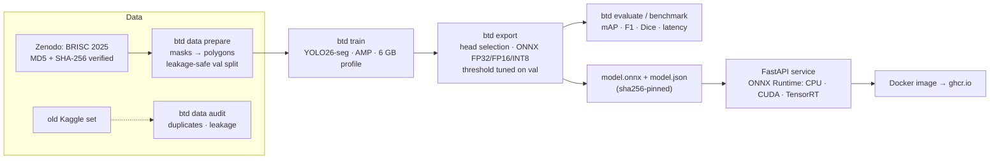
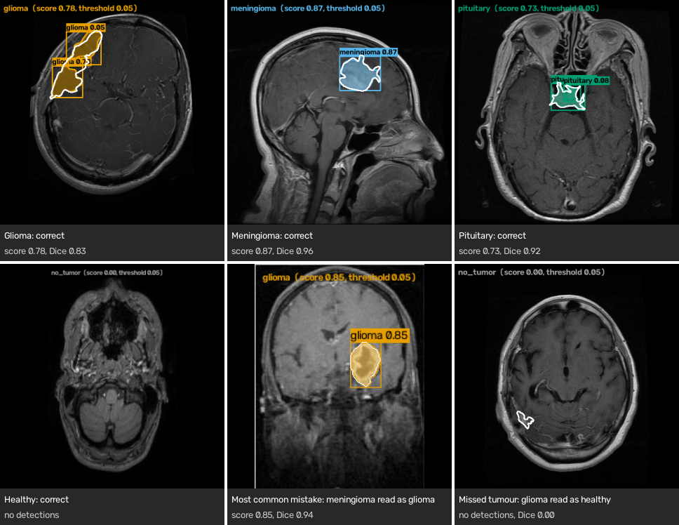
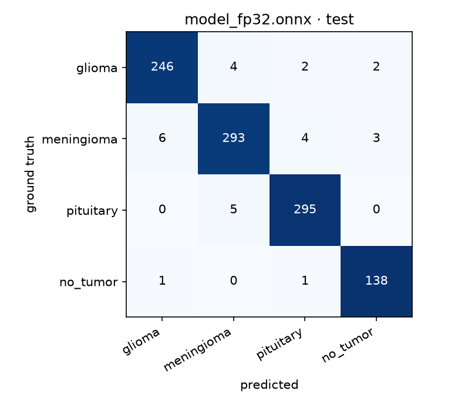
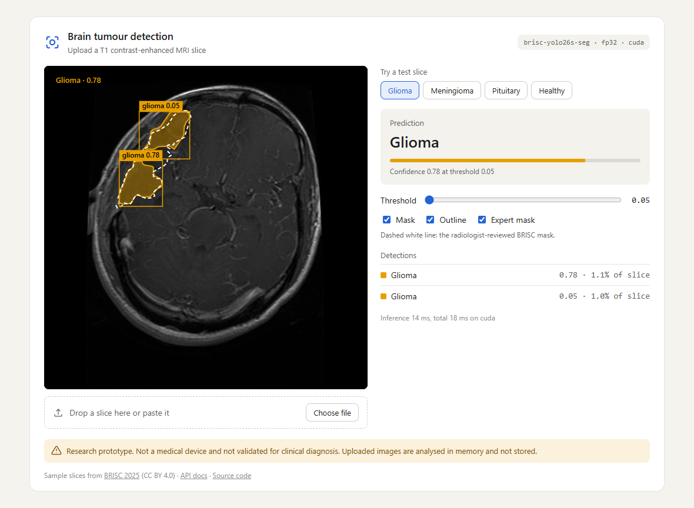
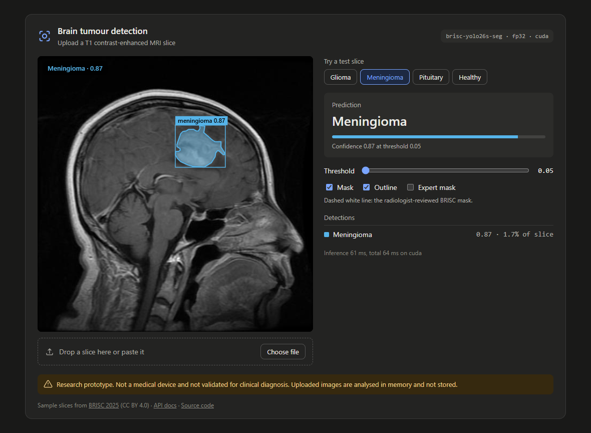
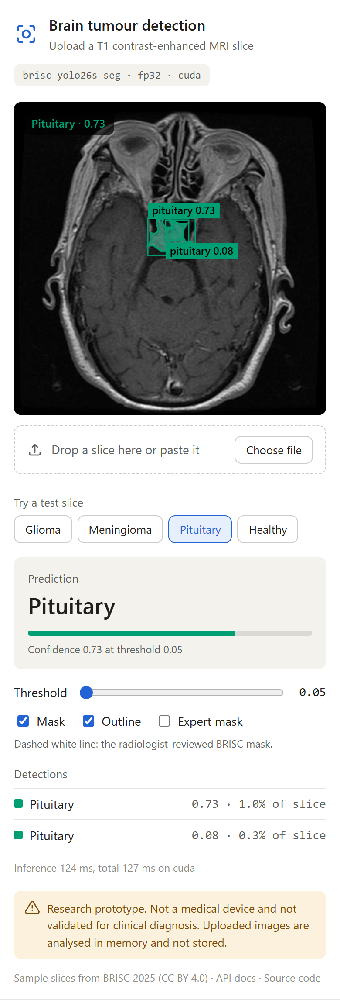

# Brain Tumour Detection & Segmentation

[](https://github.com/leon2378/brain-tumor-detection/actions/workflows/ci.yml)
[](https://github.com/leon2378/brain-tumor-detection/actions/workflows/codeql.yml)


An end-to-end, production-style pipeline that finds and outlines **glioma, meningioma and pituitary tumours** on
T1-weighted contrast-enhanced MRI slices — from a verified dataset download to a quantised model served by a
torch-free FastAPI container, with every step exercised by GitHub Actions on each push.

> **Not a medical device.** Research and educational prototype, not validated for clinical use.

For each uploaded slice the service returns:

- an image-level decision: `glioma` · `meningioma` · `pituitary` · `no_tumor`
- a box, a pixel mask and a polygon outline for every tumour instance, plus its area
- optionally a PNG overlay or the mask itself, for a future frontend

## Design at a glance

| Concern | Choice | Why |
|---|---|---|
| Data | [BRISC 2025](https://doi.org/10.5281/zenodo.17524350): 6,000 slices, expert masks, CC BY 4.0 | Mostly de-duplicated; `btd data prepare` drops the training slices that still duplicate a test slice. Also has pixel masks, so detection and segmentation can be learned. Folder-labelled Kaggle sets can't do that ([why](docs/DATASET.md)) |
| Data checks | `btd data audit` finds exact and near duplicates and train↔test leakage; SHA-256/MD5 verification; zip-slip-safe extraction | You can't trust a 99% accuracy until you know the test set isn't in the training set |
| Validation split | Stratified by class and imaging plane, **grouped by near-duplicate clusters** | Near-identical slices can't land on both sides of the split |
| Model | One **YOLO26-seg** model that outputs class, box and mask together | Replaces a separate detector and segmenter. The NMS-free and NMS heads are both scored on val, and the better one ships |
| Training | AMP (FP16 mixed precision), batch 8 @ 640, MRI-specific augmentations | Fits a **6 GB** GPU |
| Deployment precision | ONNX **FP32 / FP16 / INT8** (+ optional TensorRT). The same letterbox code is used for calibration and serving | INT8 is about 3.2× smaller and faster on x86 CPUs at 640 px, but costs 3.4 points of accuracy, so the CPU image ships FP32. FP16 is the right choice on a CUDA GPU ([details](docs/QUANTIZATION.md)) |
| Operating point | Image-level threshold tuned **on validation only** (macro-F1), stored in `model.json` | The test set is touched exactly once |
| Serving | FastAPI + ONNX Runtime + numpy post-processing. No torch in the image | The numpy decoder matches Ultralytics' own ONNX predictions (boxes, scores, masks), and CI checks this on every push. The image is small and starts fast |
| Hardening | Request IDs, JSON logs, Prometheus metrics, upload type/size/pixel limits, optional API key, non-root read-only container, checksum-pinned model | Standard things an on-call engineer expects |
| CI/CD | Lint, types, tests on Python 3.10 and 3.12, synthetic end-to-end ML run, Docker smoke test, Trivy, CodeQL, and publishing to GHCR with SBOM + provenance | Every push proves the whole pipeline still works |

## Architecture



## Results

> Filled in from `reports/` after training on BRISC (`btd evaluate --map`, `btd benchmark`). All numbers are on the
> **official BRISC test split** (1,000 slices), which is never used for training, model selection or threshold tuning.

| Precision | Size | Mask mAP50-95 | Image acc. | Macro-F1 | Sensitivity | Specificity | Dice | CPU p50 | GPU p50 |
|---|---|---|---|---|---|---|---|---|---|
| FP32 | 41.8 MB | 0.642 | 0.972 | 0.972 | 0.994 | 0.986 | 0.841 | 74.0 ms | 14.0 ms |
| FP16 | 21.0 MB | 0.642 | 0.972 | 0.972 | 0.994 | 0.986 | 0.841 | 76.9 ms | 12.4 ms |
| INT8 | 11.3 MB | 0.630 | 0.938 | 0.934 | 0.969 | 0.986 | 0.803 | 47.5 ms | 28.5 ms |

`yolo26s-seg` @640, 101 epochs (early stopping; best epoch 76), batch 8, AMP. Latency is end-to-end (pre-process,
inference, decode, masks) over 100 runs on an RTX 3060 Laptop GPU (6 GB) and a Ryzen 7 5800H CPU. INT8 pays off only
on CPU: the CUDA provider handles quantised graphs poorly, so INT8 is *slower* than FP32 on the GPU. FP16 is the best
GPU build — identical accuracy to FP32, half the file, 182 MB of GPU memory.

Training peak VRAM (from `run_summary.json`): 3.13 GB on a 6 GB card.

### What the predictions look like



Filled colour is the model's mask, drawn exactly as `/v1/predict/overlay` returns it; the white outline is the expert
mask. The slices are chosen by rule, not by hand ([`scripts/make_readme_figure.py`](scripts/make_readme_figure.py)):
for each tumour class the correct prediction with the median Dice, a correctly rejected healthy slice, the most
common mistake at its median confidence, and a missed tumour. Some slices show a weak second detection such as
`glioma 0.05`, because the operating threshold is 0.05.

The mistake panel shows how the model usually fails: the tumour is outlined almost perfectly (Dice 0.94) but given
the wrong type. 21 of its 28 test errors are one tumour type read as another; 5 are missed tumours and 2 are healthy
slices flagged as tumours.



## Quick start (Windows + conda, NVIDIA 6 GB GPU)

The full walkthrough, with troubleshooting, is in [docs/WINDOWS_SETUP.md](docs/WINDOWS_SETUP.md).

```powershell
conda activate torch_new
cd brain-tumor-detection
python -m pip install -e ".[train,serve,cpu,dev]"   # uses the CUDA torch already in the env; never reinstalls torch

btd env                                  # torch / CUDA / GPU / onnxruntime report + fix-up hints
btd data download                        # BRISC 2025 from Zenodo (~260 MB, MD5-verified)
btd data prepare                         # → data/processed/brisc-yolo (+ splits.csv, prepare_report.json)
btd train                                # configs/train.yaml: yolo26s-seg, batch 8, AMP
btd export                               # newest runs/segment/*/weights/best.pt → artifacts/model
btd evaluate --map                       # test-set report for FP32/FP16/INT8 → reports/
btd benchmark --providers cpu cuda       # latency, size, GPU memory → reports/benchmark.md
btd package --precision fp32             # → models/model.onnx + models/model.json
btd serve --model models/model.onnx      # web page at http://127.0.0.1:8000, API docs at /docs
```

Optional: see how leaky the old Kaggle dataset is:

```powershell
btd data audit --data "..\Brain Tumor MRI Data" --out reports/audit-kaggle
```

## Web page



<p align="center">
  
  
</p>

Open http://127.0.0.1:8000 in a browser. Drop an MRI slice onto the page, paste one, or try one of the four sample
slices from the BRISC test split. The page draws the predicted tumour outlines returned by `/v1/predict`, and for the
samples it can overlay the expert mask too. Moving the threshold slider or the mask toggles updates the result
instantly in the browser, without another request. It's plain HTML, CSS and JavaScript served by the API itself
([`src/btd/api/static/`](src/btd/api/static/)): no build step, nothing loaded from other sites, and a strict
Content Security Policy. Set `BTD_UI=false` for API-only deployments.

Links open a sample directly, which is handy for demos: `/?sample=glioma&expert=1&threshold=0.1` loads the glioma
slice with the expert mask shown and the threshold at 0.10. The screenshots above were taken that way from the
released model by [`scripts/make_ui_screenshots.py`](scripts/make_ui_screenshots.py). In the glioma one, the weak
`glioma 0.05` detection sits inside the expert mask: it's the upper part of the same tumour, so raising the
threshold hides real tumour rather than noise.

The page takes any image, and the model answers whatever you give it: a landscape photo comes back as "glioma 0.81".
So colour images, which can't be MRI slices, get a warning above the prediction. That check is basic, and greyscale
photos or other MRI sequences still get through. The [model card](MODEL_CARD.md#behaviour-outside-the-training-data)
has the details, and what the model does with rotated, inverted, blurred and non-MRI inputs.

## API

| Method | Path | Purpose |
|---|---|---|
| `GET` | `/` | the web page in a browser; a small JSON index for API clients |
| `GET` | `/health` | liveness |
| `GET` | `/ready` | readiness: model loaded and warmed up (503 otherwise) |
| `GET` | `/v1/model` | model name, version, precision, classes, threshold, SHA-256, execution provider |
| `POST` | `/v1/predict` | multipart `file` → decision + detections (`?include_mask=true`, `?include_polygons=false`, `?conf=`) |
| `POST` | `/v1/predict/overlay` | multipart `file` → PNG with masks, boxes and decision |
| `GET` | `/metrics` | Prometheus metrics |
| `GET` / `POST` | `/ping` / `/invocations` | SageMaker's health check and raw-body prediction, only with `BTD_SAGEMAKER=true` |

```bash
curl -F "file=@slice.jpg" http://localhost:8000/v1/predict
curl -F "file=@slice.jpg" http://localhost:8000/v1/predict/overlay -o overlay.png
```

Example response (illustrative values):

```json
{
  "request_id": "5f0c…",
  "model": {"name": "brisc-yolo26s-seg", "version": "0.1.0", "precision": "fp32", "provider": "CPUExecutionProvider"},
  "image": {"width": 512, "height": 512},
  "decision": {"label": "meningioma", "score": 0.91, "threshold": 0.05, "tumor_detected": true},
  "detections": [{"class_name": "meningioma", "confidence": 0.91, "box": {"x1": 301.2, "y1": 88.0, "x2": 371.9, "y2": 150.4},
                  "area_px": 3412, "area_fraction": 0.013, "polygons": [[[318, 90], [305, 104], "…"]]}],
  "timings_ms": {"preprocess_ms": 1.1, "inference_ms": 70.2, "postprocess_ms": 2.0, "total_ms": 73.3},
  "warnings": [],
  "disclaimer": "Research/educational prototype. Not a medical device and not validated for clinical diagnosis."
}
```

Configuration is through `BTD_*` environment variables (see [`.env.example`](.env.example)). The main ones are
`BTD_MODEL_PATH`, `BTD_PROVIDERS` (`cpu`, `cuda`, `tensorrt`, `auto`), `BTD_API_KEY`, `BTD_MAX_UPLOAD_MB`,
`BTD_CORS_ORIGINS`, `BTD_GPU_MEM_LIMIT_MB`, `BTD_UI` and `BTD_SAGEMAKER`. `btd serve` also takes its host and port
from `BTD_HOST` and `BTD_PORT` when no flags are given. The `conf` query parameter only changes which detections are
*shown*. The image-level decision always uses the calibrated threshold.

`warnings` lists reasons to distrust a result. Currently the only one is `not_greyscale`, for colour images that are
unlikely to be MRI slices; `/v1/predict/overlay` reports it in an `X-Input-Warnings` header instead.

## Docker

```bash
btd package --precision fp32                        # CPU model → ./models
docker compose up --build                           # web page at http://localhost:8000, API docs at /docs
btd package --precision fp16 --dest models-gpu      # GPU model → ./models-gpu
docker compose --profile gpu up --build             # http://localhost:8001 (needs NVIDIA Container Toolkit)
```

The CPU image has no torch and no Ultralytics. Dependencies are installed from hash-locked files in
[`requirements/`](requirements/), and the container runs as UID 10001 with a read-only filesystem.

The lock files are generated with [uv](https://docs.astral.sh/uv/) (`pip install uv`). Never edit them by hand:

| Task | With make | Without make (e.g. Windows) |
|---|---|---|
| Re-lock after changing `pyproject.toml` | `make lock` | `python scripts/lock.py` |
| Upgrade every pin to the newest compatible release | `make upgrade` | `python scripts/lock.py --upgrade` |
| Check the locks are up to date (CI does this) | `make check-lock` | `python scripts/lock.py --check` |

## Amazon SageMaker

The same CPU image runs on a SageMaker endpoint. With `BTD_SAGEMAKER=true` the API adds SageMaker's `/ping` and
`/invocations` routes, and [`scripts/sagemaker.py`](scripts/sagemaker.py) copies the image into ECR, deploys the
endpoint, calls it, and deletes it again:

```bash
python scripts/sagemaker.py push --tag 0.1.4
python scripts/sagemaker.py deploy --tag 0.1.4 --role-arn arn:aws:iam::<account>:role/btd-sagemaker-execution --instance-type ml.t2.medium
python scripts/sagemaker.py invoke --repeat 3
python scripts/sagemaker.py delete --everything
```

A real-time endpoint on one `ml.t2.medium` in `ap-southeast-2` reached InService in under 2 minutes and answered
3 of 3 calls with the glioma sample (359–385 ms each). The serverless variant (leave out `--instance-type`) fails
with a generic error and no logs; what's been ruled out is in [docs/SAGEMAKER.md](docs/SAGEMAKER.md), along with the
one-off AWS setup, costs and troubleshooting.

## CI/CD (GitHub Actions)

Every push and pull request runs [`ci.yml`](.github/workflows/ci.yml):

```text
lint (ruff, mypy, lock-file drift) ─┐
tests (py3.10 + py3.12, ≥75% cov) ──┼─► docker: build → run read-only, non-root → smoke test → Trivy scan ─┐
ml-pipeline (synthetic data, CPU): prepare → train → export FP32/FP16/INT8 → parity → evaluate → serve ─┴─► publish
```

`publish` runs on `v*.*.*` tags only (pushes to `main` run every other job but publish nothing). It pushes
`ghcr.io/leon2378/brain-tumor-detection` tagged with the version, `major.minor`, the short SHA and `latest`. Each
image comes with an SBOM and build provenance. Tags also build the `-gpu` image.
[`codeql.yml`](.github/workflows/codeql.yml) scans the Python code and the workflows.

Dependencies are updated by hand. `make upgrade` (or `python scripts/lock.py --upgrade`) moves every Python pin at
once, which keeps exact pairs such as pydantic and pydantic-core in step. Action versions live in
`.github/workflows/` and the base images in `docker/`. Actions are pinned to major version tags; pin them to commit
SHAs if you need stricter supply-chain guarantees.

To **bake a trained model into the published image**, attach it to a GitHub release and point the workflow at it:

```bash
btd package --precision fp32
gh release create model-v1 models/model.onnx models/model.json --title "BRISC YOLO26s-seg FP32" --notes-file reports/evaluation_test.md
gh variable set MODEL_RELEASE_TAG --body model-v1
git tag v0.1.0 && git push origin v0.1.0
```

## Repository layout

```text
src/btd/
  data/        download.py (Zenodo + checksums) · brisc.py (index/manifest) · audit.py + hashing.py (duplicates/leakage)
               prepare.py (masks → YOLO polygons, grouped split) · synthetic.py (CI data)
  training/    train.py (Ultralytics wrapper, 6 GB profile) · evaluate.py · metrics.py (numpy-only)
  export/      pipeline.py (head selection, ONNX, threshold tuning, model.json) · quantize.py (FP16 / INT8) · benchmark.py
  inference/   preprocess.py · postprocess.py (numpy decode + masks) · engine.py (ONNX Runtime) · visualize.py
               quality.py (input checks, e.g. colour images)
  api/         app.py (FastAPI) · schemas.py · settings.py · static/ (web page and sample slices)
  cli.py       the `btd` command
configs/       train.yaml (6 GB profile) · export.yaml (precisions, INT8 calibration, TensorRT)
docker/        Dockerfile (CPU) · Dockerfile.gpu (CUDA via pip wheels)
requirements/  hash-locked serving dependencies
tests/         unit/ · api/ · pipeline/ (end-to-end, `-m pipeline`)
scripts/       smoke_test.py (API check used by CI) · lock.py (uv lock files) · make_readme_figure.py
               make_demo_samples.py (the web page's sample slices) · make_ui_screenshots.py
               sagemaker.py (SageMaker endpoint: push, deploy, invoke, status, delete)
docs/          DATASET.md · QUANTIZATION.md · WINDOWS_SETUP.md · SAGEMAKER.md · images/ (README figures)
```

## Development

```bash
pip install -e ".[serve,cpu,headless,dev]"   # serving stack, no torch
make lint test                               # ruff + mypy + unit/API tests
pip install -e ".[train]" && make test-pipeline   # full ML pipeline on synthetic data (CPU, ~2-5 min)
pre-commit install
```

## Limitations

- These are 2-D slices from a single sequence (T1 contrast-enhanced). There's no volumetric context and no
  multi-sequence (FLAIR/T2) input.
- BRISC has no patient IDs, so splits are slice-level. BRISC removed duplicates and this project additionally
  groups near-duplicates, but leakage between two slices of the same patient can't be ruled out completely.
- The image-level "no tumour" call comes from detection confidence. Very small or faint lesions will be missed.
- The public source data comes from a small number of institutions. Expect domain shift on other scanners and protocols.

See [MODEL_CARD.md](MODEL_CARD.md) for intended use and evaluation details.

## License and citation

The code is licensed under **AGPL-3.0**, because it builds on [Ultralytics YOLO](https://github.com/ultralytics/ultralytics),
which is AGPL-3.0. Trained weights derived from Ultralytics' pretrained checkpoints fall under the same terms.

The dataset is **BRISC 2025** (CC BY 4.0), so attribution is required:

```bibtex
@article{fateh2026brisc,
  title   = {BRISC: Annotated Dataset for Brain Tumor Segmentation and Classification},
  author  = {Fateh, Amirreza and others},
  journal = {Scientific Data},
  year    = {2026},
  doi     = {10.1038/s41597-026-06753-y}
}
```
